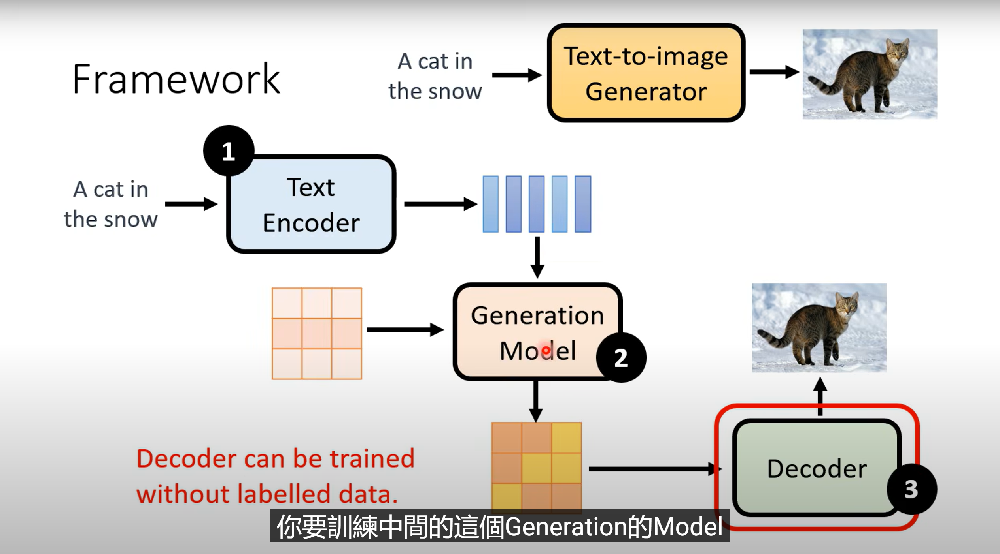
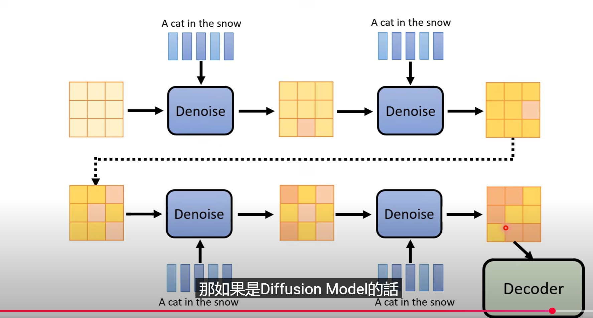
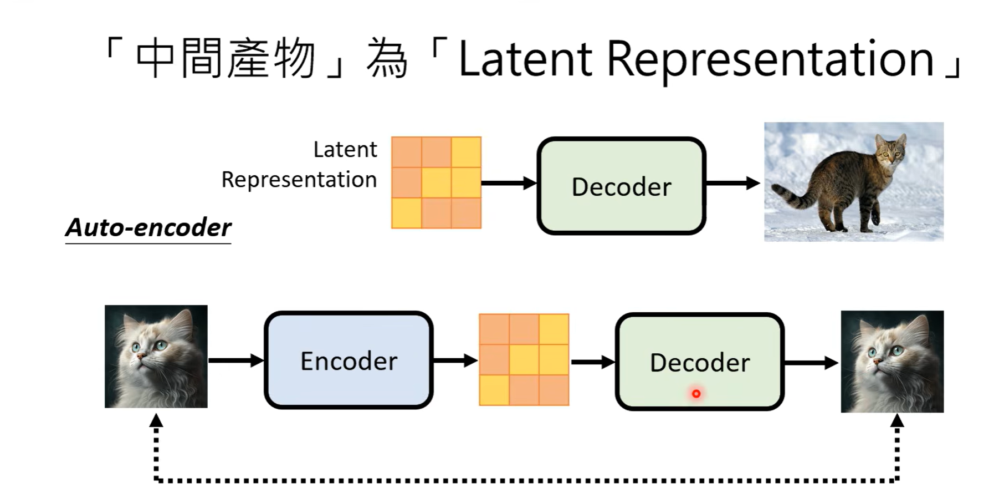
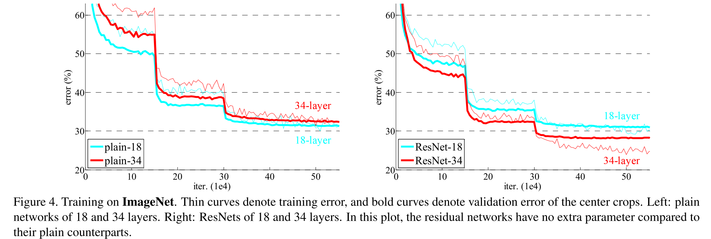
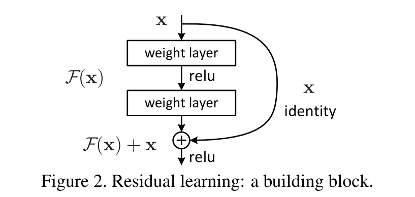
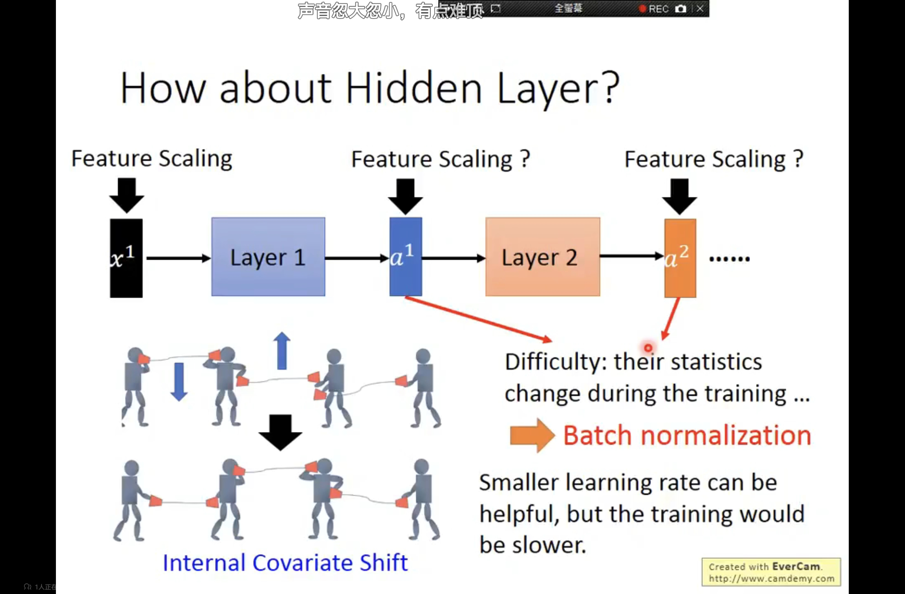
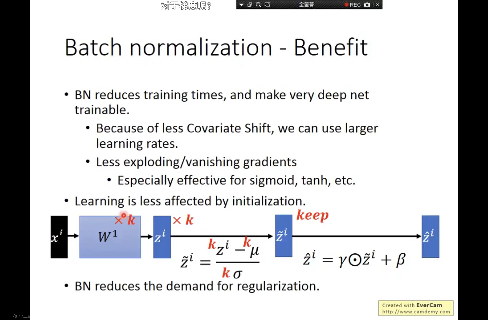
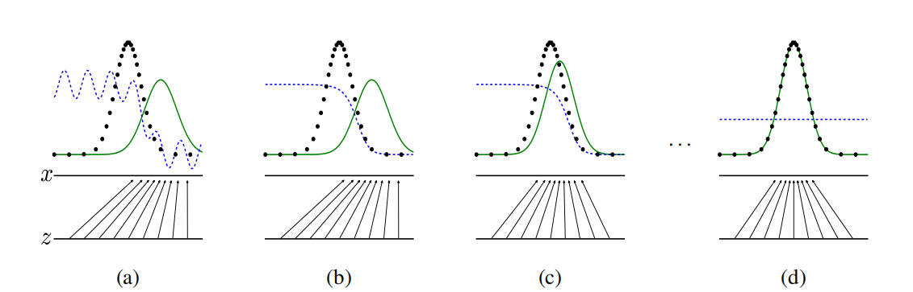
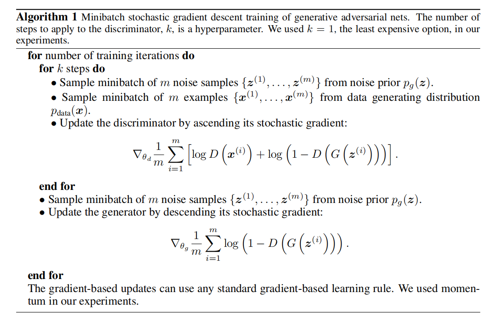

## AI Learning


### Function

`os.listdir(file_path)` 寻找 file_path 下所有文件，==返回一个字符串列表==，然后再用 `.endwith()` 函数就可以找出给定文件


`pd.read_excel(file_path)`  返回的是一个Dataframe，和excel表格很相似，访问元素的时候要用函数 `df.iloc[2, 3]` 形式访问，`df[2][3]` 代表的是==列名为2、行索引为3==， 即 `df[列名，行索引]` ；此时如果想转换为 numpy 形式，就直接 `.values` 就行，然后 `torch.tensor(df)` 就转换为 tensor 格式了


`torch.arange(a, b, dtype=torch.float).unsqueeze(1)` 包含了两个函数，`arange(a, b, dtype=torch.float)` 返回一个torch列表，从a到b-1，然后 `.unsqueeze(dim)` 代表在==第dim个维度处插入一个维度为1的新轴==，如：

```txt
unsqueeze(0):
[[1, 2, 3]]      # shape: (1, 3) —— 横向

unsqueeze(1):
[[1],
 [2],
 [3]]            # shape: (3, 1) —— 纵向
```


`x.permute(), x.transpose()` 进行张量的维度之间的重排、交换

```python
x.transpose(dim0, dim1)     # swap dim1 and dim2
x = torch.randn(2, 3, 4)    # shape = (2, 3, 4)
y = x.permute(2, 0, 1)      # shape = (4, 2, 3)
```

上面的操作可能会让内存变得不连续


`x.view(B, -1)`, `x.reshape(B, -1)` 都是用来改变张量形状的函数，view 更加高效，但是只能用于连续内存，这也意味着，如果张量在之前经过了 `.permute()`或者 `.transpose()` 函数，该操作会导致报错

```python
x.shape = (B, C, H, W) = (32, 64, 7, 7)
x = x.view(B, -1)  # (32, 64, 7, 7) -> (32, 64*7*7) 
x = x.reshape(B, -1)  # (32, 64, 7, 7) -> (32, 64*7*7) 
```

 `view, reshape` 在语法上没有什么区别，都支持 -1 进行自动推导，但是 reshape 可以进行非连续内存的操作，只是效率更低


`np.ploy` 系列有很多关于多项式的函数

```python
p = np.ploy1d([2, 6, 3])
p(1)
>> 11
p.r  # 多项式的根
>> array([-0.5, -3])
np.ployval([2, 1, 3], 2)  # 计算多项式的值
>> 13
coeff = [3.2, 2, 1]
np.roots(coeff)
>> array([-0.3125+0.46351241j, -0.3125-0.46351241j])
```

还有拟合系列

```python
coef = np.polyfit(x, y_change, 6)
p = np.poly1d(coef)  # coef 得到的是一个系数的数组，代表拟合结果
```

同样，np还有很多数值计算的方法，如计算协方差

```python
cov_mat = np.cov(y_indexinfo_change, y_change)  # 直接返回协方差矩阵
cov_two = cov_mat[0][1]
```


```bash
conda info
```

一行指令可以展现当前虚拟环境信息

```bash
conda info --envs
conda activate normal # 激活 normal 虚拟环境
```

展示当前虚拟环境列表


### Knowledge


2025 0415

重新看了一遍3B1B的视频，看来我以前对 Attention 这个东西的认知是有问题的， Attention 模块不会对输入序列做一个扩充，实际上是根据每一个时间点数据之间的相关性，不断更新内部数据，以 GPT3 为例，对于一个已经预训练好的词嵌入表，不能简单地通过将tokens和词表中的元素一一对应，而是要通过 Attention 模块，==不断通过词与词之间的联系 （$QK^T$），更新词的内涵（向量点积），从而让每一个词都具有上下文信息！==然后，接下来一个输出的tokens就完全依赖于最后一个序列数据，根据其输出一个概率分布

至于 transformer 层中的 MLP 层，其参数量甚至是要多于 Attention层中 $Q,K,V$的参数量的（GPT3），MLP 层是实现维度之间交流的关键，同时也是提高非线性表达能力的关键（ReLU）。换句话说，MLP 是大模型中与训练后存储信息的关键

 

20250416

1*1 卷积核也是可行的，并不是无意义的

卷积网络参数量：`c_in * c_out * n*n` ，参数分别代表：输入通道数，输出通道数，卷积核大小

因此 1*1 卷积核可以大大减少神经网络的训练时间和复杂度，同时 1\*1 的卷积核实际上是对矩阵的每个元素==所有通道特征做一个融合==（逐元素的加权平均）


20250419

多层神经网络中，如果变换全部都是线性的，那么和单独一层变换其实没有本质区别，只有在其中添加激活函数，引入非线性，才能提高神经网络的表达能力


20250511

学习Python的函数的时候，和C++是不一样的，C++的很多语法规则固定且很少，因此有些需要掌握全面，但是Python非常灵活，记函数大可不必，但是要知道函数是用来做什么的，==需要哪些参数==，这个很重要

torch 框架训练过程经典代码：

```python
    n_epoches = 10
    losses = []
    for epoch in range(n_epoches):
        loss_all = 0
        for i, (images, labels) in enumerate(train_loader):
            # 1. to(device)
            images = images.to(device)
            labels = labels.to(device)
            # 2. zero_grad
            optimizer.zero_grad()
            # 3. train(core)
            output = model(images)

            loss = criterion(output, labels)
            loss_all += loss.item()

            # 4. gradient back
            loss.backward()
            optimizer.step()  # CORE!!  Update parameters
            if i % 100 == 99:
                print(f"Epoch {epoch + 1}, Batch {i + 1}, Loss : {loss_all:.4f}")
        losses.append(loss_all)
        loss_all = 0
```

测试过程经典代码：

```python
    model.eval()
    correct = 0
    total = 0
    
    with torch.no_grad():
        for images, labels in val_loader:
            images = images.to(device)
            labels = labels.to(device)
            output = model(images)
            _, predict = torch.max(output, 1)            
            # torch.max() 返回两个值: 最大值和其索引，这里我们仅关心索引；参数中，1代表沿着第二个维度寻找最大值
            # output 的格式：(batch_size, class_nums), 在第二个维度寻找最大值找出预测结果类
            correct += (predict == labels).sum().item()	 
            # (predict == labels) 中，predict 和 labels 都是数组，但是该表达式返回了一个布尔张量，.sum() 方法求和，然后 .item() 方法得到值的大小·
            # predict 和 labels 都是 torch张量
            total += labels.size(0)
```


20250518

==KL散度==
$$
D_{\mathrm{KL}}(P \,\|\, Q) = \int_{-\infty}^{\infty} P(x) \log \frac{P(x)}{Q(x)} \, dx
$$
KL 散度（Kullback-Leibler Divergence）是衡量两个概率分布之间差异的非对称性指标，它==表达了使用分布 $Q$ 来近似真实分布 $P$ 时所导致的信息损失量==

在信息论的视角下，它可以理解为：若我们用基于 $Q$ 的压缩编码去编码由 $P$ 生成的数据序列，则每一个样本所增加的平均编码长度，就是 $D_{\mathrm{KL}}(P | Q)$

在概率建模中，$P(x)$ 往往代表真实数据分布，$Q(x)$ 是模型预测分布，KL 散度的优化过程就是试图最小化这两者之间的“信息距离”。其值总是非负的，==只有在 $P = Q$ 时才为 0==，但由于它不对称，因此不能作为真正的距离度量

直观上，当 $P(x)$ 在某些区域为非零而 $Q(x)$ 接近于零时，KL 散度会迅速变大，说明模型对这些重要区域“盲视”，这也是 KL 在分布估计中惩罚性极强的地方。KL 散度常出现在变分推断、生成模型（如 VAE）、语言模型训练与强化学习的策略优化等重要场景中，是理解概率建模不可或缺的基础概念之一


20250519

利用Pytorch时，继承`nn.Module` 类的优点：

1. 自动参数管理，利用 `nn.parameters()` 可以访问全部参数，传入优化器
2. 模块化设计，即：多个模型继承自 `nn.Module` ，但是它们之间仍然可以相互嵌套，不像C++中有那么严格的继承关系
3. 实现模型的保存和加载
4. 实现训练模式和评估模式的切换
5. 自动调用 forward 方法
6. 设备管理，`.to(device)`，可以切换至 GPU 或 CPU


20250522

简单读了几篇关于文字生成、古籍文字识别的文章，基于GAN的改进，或者通过捕捉文字局部特征进行识别、或者进行图像的检索


20250525

下图描述了如 Stable Diffusion、DALL-E、Imagen 等图像生成模型的固有组件



首先是一个针对文本的 Encoder，将文本转换为机器可理解的向量语言；然后是一个 Generation Model，从向量语言中提取图像特征，生成的有可能是一个 latent vector，也有可能是一个压缩后的图像；最后是一个 Decoder，从上一个模型中得到的图像特征数据，还原为一个完整的图像。

第一步用的模型如 Transformer 等，转换文本为数据

第二步可以用 Diffusion，VAE 等，其中如果是 Diffusion，这个时候的噪音施加在 latent vector 上的



第三步的 Decoder，训练数据可以是任何图片，不需要是一个带标签的图片




### Adam (paper: Adam: A Method For Stochastic Optimization)

Adam（Adaptive Moment Estimation）是一种自适应一阶优化算法，由 Kingma 和 Ba 于 2015 年提出，结合了 Momentum 和 RMSProp 的思想。它通过对梯度的一阶矩（均值）与二阶矩（未中心方差）进行指数加权估计，自动为每个参数分配学习率，使训练过程更快、更稳定。

---

#### $ \text{参数更新公式与偏差修正} $

Adam 在每一步更新中维护以下两个变量：

$$
\begin{aligned}
m_t &= \beta_1 m_{t-1} + (1 - \beta_1) g_t \\
v_t &= \beta_2 v_{t-1} + (1 - \beta_2) g_t^2
\end{aligned}
$$

由于初始化为 $m_0 = 0, v_0 = 0$，在初期估计存在偏差，因此引入偏差修正项：

$$
\hat{m}_t = \frac{m_t}{1 - \beta_1^t}, \quad \hat{v}_t = \frac{v_t}{1 - \beta_2^t}
$$

最终更新规则为：

$$
\theta_{t+1} = \theta_t - \alpha \cdot \frac{\hat{m}_t}{\sqrt{\hat{v}_t} + \varepsilon}
$$

其中 $\alpha$ 是全局学习率，$\varepsilon$ 为数值稳定项。

---

#### $ \text{自适应学习率机制} $

Adam 会根据每个参数过去的梯度平方估计值 $v_t$ 调整其学习率。$v_t$ 越大表示该参数历史梯度震荡较大，因此其学习率会自动变小，反之则变大。调整形式为：

$$
\text{Effective learning rate} = \frac{\alpha}{\sqrt{\hat{v}_t} + \varepsilon}
$$

这种机制避免了手动调参，并可适应稀疏梯度或不同尺度的参数空间。

---

#### $ \text{一阶与二阶矩估计的推导} $

对二阶矩的推导中，将 $v_t$ 展开为显式加权和：

$$
v_t = (1 - \beta_2) \sum_{i=1}^{t} \beta_2^{t - i} g_i^2
$$

在每一步期望下，有：

$$
\mathbb{E}[v_t] = \mathbb{E}[g_t^2] (1 - \beta_2^t)
$$

因此需通过除以 $1 - \beta_2^t$ 来进行偏差修正，得到无偏估计：

$$
\hat{v}_t = \frac{v_t}{1 - \beta_2^t}
$$

同理可得 $\hat{m}_t$ 的偏差修正方式。

---

#### $ \text{与 SGD 的联系和区别} $

SGD 使用固定的学习率和真实梯度估计：

$$
\theta_{t+1} = \theta_t - \alpha \cdot g_t
$$

而 Adam 使用一阶与二阶矩对梯度进行平滑与缩放。SGD 更依赖学习率调参，适用于凸优化问题。Adam 适用于噪声较大的、非平稳或非凸任务。

---

#### $ \text{收敛性分析与 Regret 上界} $

Adam 在在线凸优化框架下，其性能通过 Regret 衡量：

$$
R(T) = \sum_{t=1}^T (f_t(\theta_t) - f_t(\theta^*))
$$

若目标函数 $f_t$ 为凸函数，梯度有界，且使用 $\alpha_t = \alpha / \sqrt{t}$，则可证明：

$$
R(T) = \mathcal{O}(\sqrt{T})
$$

证明中依赖加权距离函数与动量项的累积控制，确保参数不会发散。该结论表明 Adam 在凸问题下具有合理收敛性。但在非凸问题中，原始 Adam 可能不收敛，需引入 AMSGrad 等变种修正。

---

#### $ \text{什么是凸函数与非凸问题} $

若函数满足：

$$
f(\lambda x + (1 - \lambda) y) \leq \lambda f(x) + (1 - \lambda) f(y), \quad \forall \lambda \in [0,1]
$$

则为凸函数。==凸函数图像上任意两点连线在图像之上，意味着局部最优即为全局最优。SGD 和 Adam 等优化器在凸函数上理论收敛可证。而神经网络的损失函数通常非凸，存在多个极小值或鞍点，因此非凸优化难度更大，需依赖动量、自适应调整等策略帮助跳出局部最优。==

---

#### $ \text{稀疏梯度（Sparse Gradients）的定义与特性} $

稀疏梯度是指在一次反向传播中，大多数参数的梯度为零，仅有极少数参数被更新。数学上，若参数向量为 $ \theta \in \mathbb{R}^n $，则其梯度 $ \nabla_\theta J(\theta) \in \mathbb{R}^n $ 中只有 $ k \ll n $ 个分量非零，即为稀疏梯度。

此类情况常出现在输入为稀疏向量（如 one-hot 编码）、嵌入矩阵（如词向量）或推荐系统中的用户/物品表示中。例如，在词嵌入层中，词表大小可能为 $10^5$，但一个 batch 只涉及其中少量词汇，因此嵌入矩阵中仅极少数行会产生梯度，其他行梯度为 0。

---

#### $ \text{稀疏梯度的优化难点} $

在稀疏场景下，传统的 SGD 对每个参数使用统一的全局学习率：

$$
\theta_{t+1} = \theta_t - \alpha \cdot \nabla_\theta J(\theta)
$$

这种方式对稀疏参数不友好。频繁被更新的参数会过度更新，易震荡；很少被更新的参数由于学习率不变，导致学习缓慢，甚至停滞。

---

#### $ \text{Adagrad 对稀疏梯度的处理方式} $

Adagrad 利用历史梯度平方的累积来自动缩放每个参数的学习率：

$$
G_t = \sum_{i=1}^{t} g_i^2
$$

$$
\theta_{t+1, i} = \theta_{t, i} - \frac{\alpha}{\sqrt{G_{t, i}} + \varepsilon} \cdot g_{t,i}
$$

对频繁更新的维度 $i$，累积项 $G_{t, i}$ 越大，学习率越小；而对不常更新的维度，学习率保持较大。这种机制使 Adagrad 在 NLP 与推荐等稀疏场景中表现良好。

---

#### $ \text{Adam 对稀疏梯度的适应机制} $

Adam 通过维护梯度一阶矩与二阶矩的指数加权平均来调整学习率。其二阶矩估计如下：

$$
v_t = \beta_2 v_{t-1} + (1 - \beta_2) g_t^2
$$

在稀疏梯度下，若 $ \beta_2 \rightarrow 1 $，滑动平均 $v_t$ 会偏向 0，导致学习率项：

$$
\frac{1}{\sqrt{v_t} + \varepsilon}
$$

显著放大，产生过大的参数更新，训练不稳定。为此，Adam 引入偏差修正：

$$
\hat{v}_t = \frac{v_t}{1 - \beta_2^t}
$$

确保即使 $ \beta_2 \approx 1 $，初期估计仍然合理，防止学习率爆炸。相比 RMSProp，Adam 在处理稀疏梯度时更稳定，更新更平滑。


### ResNet（paper：Deep Residual Learning for Image Recognition）


在深度学习中，训练层的深度会很大程度的影响训练效果，但是当训练深度加深时，会出现很多问题，最典型的如 vanishing/exploding gradients



如上图，在一个深层卷积神经网络中，上左图没有进行残差连接，但是34层的神经网络的训练误差竟然要高于18层的训练误差，这不是因为 overfit 导致的（文章开头有提到），因为 overfit 的特征应该是在训练集上表现出较低的误差，但是在测试集上效果远不如训练集

上右图是加上残差连接的结果，可以看出34层的神经网络可以达到更低的训练误差（测试集: ImageNet）



上图是残差连接的基本结构，实际上就是由原先的：通过神经网络学习数据的整体特征，改为：学习数据的残差

文章提出的一个关键问题，理论上来说，更深层次的神经网络，哪怕只学习到恒等映射，也不会比浅层网络的效果更差，但实际上的测试结果表现出深层网络并没有做到这一点，（原文：==The degradation problem suggests that the solvers might have difficulties in approximating identity mappings by multiple nonlinear layers.==）意味着深层神经网络学习恒等映射也很困难（原因：梯度传播困难）。既然这样，我们就显式的引入恒等映射的参数项。这也是残差网络的想法由来


### BN/LN

首先，明确 batch normalization 和 layer normalization 的区别

```python
import torch
import torch.nn as nn

x = torch.tensor([[1., 2., 3., 4.],
                  [2., 3., 4., 5.],
                  [3., 4., 5., 6.]])

# BatchNorm
bn = nn.BatchNorm1d(num_features=4)
print("BatchNorm：\n", bn(x))

# LayerNorm
ln = nn.LayerNorm(normalized_shape=4)
print("LayerNorm：\n", ln(x))

'''
OutPut:
BatchNorm：
 tensor([[-1.2247, -1.2247, -1.2247, -1.2247],
        [ 0.0000,  0.0000,  0.0000,  0.0000],
        [ 1.2247,  1.2247,  1.2247,  1.2247]],
       grad_fn=<NativeBatchNormBackward0>)
LayerNorm：
 tensor([[-1.3416, -0.4472,  0.4472,  1.3416],
        [-1.3416, -0.4472,  0.4472,  1.3416],
        [-1.3416, -0.4472,  0.4472,  1.3416]],
       grad_fn=<NativeLayerNormBackward0>)
'''
```

bn 是横跨 batch 中的每一个样本，单独计算每个维度的 mean, std

ln 是对每一个样本中跨维度的计算，计算一个样本中所有维度数据的 mean, std

换句话说，ln 只需要一个样本就可以完成，但是 bn 需要的是一个 batch 中的所有数据

#### BatchNorm: (paper: Batch Normalization: Accelerating Deep Network Training by Reducing Internal Covariate Shift)

首先说好处：

1 可以使用更大的学习率

2 减少了梯度消失问题

3 减少了初始化对训练的影响

4 可以代替正则化，有 BN 层的神经网络不用使用 Dropout 就可以减少 overfit 的可能性



上面传电话的例子可以很好的解释 **Internal Covariate Shift** 的问题，虽然可以通过减小学习率的方法缓解这个问题，但是会降低收敛速度

当然，现在有研究认为，实际上 BN 并没有解决这个问题，只是在数据中添加了随机噪声



下面是论文内容部分

#### $$ \text{核心思想：内部协变量偏移（Internal Covariate Shift）} $$

神经网络在训练过程中，每一层的输入分布随着前一层参数更新不断变化，这种现象被称为 **内部协变量偏移**。

> 若 $$ x^{(l)} = f(W^{(l-1)} x^{(l-1)} + b^{(l-1)}) $$，则由于 $$ W^{(l-1)}, b^{(l-1)} $$ 持续变化，导致 $$ x^{(l)} $$ 的分布在训练过程中不断漂移。

这种分布漂移会导致模型训练困难、收敛速度慢，甚至引起梯度爆炸或消失。

BatchNorm 的目标是：**让每层输入的分布在训练过程中保持稳定**。

---

#### $$ \text{BN 的标准化过程与仿射重构} $$

对某一层的输入向量 $$ x = (x^{(1)}, \dots, x^{(m)}) $$，BN 执行以下步骤：（$\mu$ 和 $\sigma$ 都是一个向量, $x^{(i)}$ 代表的是 batch 中的第 i 个向量， $x_j^{(i)}$ 是该输入的第 j 个特征）

$$
\begin{aligned}
\mu_B &= \frac{1}{m} \sum_{i=1}^{m} x^{(i)} &\text{(mini-batch 均值)}\\
\sigma_B^2 &= \frac{1}{m} \sum_{i=1}^{m} (x^{(i)} - \mu_B)^2 &\text{(方差)} \\
\hat{x}^{(i)} &= \frac{x^{(i)} - \mu_B}{\sqrt{\sigma_B^2 + \varepsilon}} &\text{(标准化)} \\
y^{(i)} &= \gamma \hat{x}^{(i)} + \beta &\text{(仿射重构)}
\end{aligned}
$$

---

#### $$ \text{为何需要仿射变换（Affine Transform）} $$

虽然 $$ \hat{x} $$ 是零均值、单位方差，但这可能限制模型的表达能力。

因此引入可学习参数 $$ \gamma $$ 和 $$ \beta $$ 恢复每层的表示能力：

- $$ \gamma $$ 控制缩放；
- $$ \beta $$ 控制偏移。

若去掉 $$\gamma,\beta$$，则 $$\hat{x}$$ 的分布被硬性固定为 $$(0,1)$$，无法学习到不同方差或非零均值的特征空间。  
> 论文证明：对带 ReLU 的层，若无仿射项，梯度只依赖 $$\hat{x}$$ 的符号；模型无法把激活边界平移/缩放 → 表达受限。  
> 通过对损失 $$\ell$$ 求偏导可见 $$\partial\ell/\partial\gamma=\sum_i(\partial\ell/\partial y^{(i)})\hat{x}^{(i)}$$、$$\partial\ell/\partial\beta=\sum_i\partial\ell/\partial y^{(i)}$$，即 $$\gamma,\beta$$ 直接调控缩放与平移。

---

#### $$ \text{BN 的反向传播推导（核心公式）} $$

定义损失函数为 $$ \ell $$，考虑链式法则展开：

$$
\frac{\partial \ell}{\partial x^{(i)}} = \frac{1}{m} \cdot \gamma \cdot (\sigma_B^2 + \varepsilon)^{-1/2} \cdot \left[
m \cdot \frac{\partial \ell}{\partial y^{(i)}} - \sum_{j=1}^m \frac{\partial \ell}{\partial y^{(j)}} - \hat{x}^{(i)} \cdot \sum_{j=1}^m \left( \frac{\partial \ell}{\partial y^{(j)}} \cdot \hat{x}^{(j)} \right)
\right]
$$

BN 中参数梯度为：

$$
\frac{\partial \ell}{\partial \gamma} = \sum_{i=1}^m \frac{\partial \ell}{\partial y^{(i)}} \cdot \hat{x}^{(i)}, \quad
\frac{\partial \ell}{\partial \beta} = \sum_{i=1}^m \frac{\partial \ell}{\partial y^{(i)}}
$$

---

#### Tricks

>训练过程相较于直接 SGD 的改进：

缓解内部协变量偏移，提高 SGD 稳定性；

允许更大学习率；

降低初始化敏感性；

加速收敛；

在某些情况下提供正则化效果（类似 Dropout）。


> 训练使用 mini-batch 的 $$ \mu_B, \sigma_B^2 $$；

测试使用整个训练集估计得到的期望值 $$ \mu, \sigma^2 $$ ：（实际操作中， 用了和 RMSProp 类似的动量想法，结合训练过程中的所有 mean, std 值，一种指数平均的形式）
$$
\mu \approx \mathbb{E}[\mu_B], \quad \sigma^2 \approx \mathbb{E}[\sigma_B^2]
$$

避免因测试样本过少导致统计不准。


> 正则化效果的来源（非显式）

BN 在训练时对每一层的激活值加入了 batch 依赖的随机扰动：

相当于对每个训练样本施加了输入扰动，在一定程度上具有类似 Dropout 的作用，但论文中特别指出：BN 本身不是正则化方法，它只是带来了副作用般的正则能力。


> BN 使用时的注意事项

小 batch size 会造成估计不准，影响效果；

在 RNN 等顺序模型中，BN 可能破坏时间结构；

在多GPU卡并行中需同步统计量（SyncBN）：
$$
\mu_B^{\text{global}} = \frac{1}{N} \sum_{k=1}^{N} \mu_B^{(k)}, \quad \sigma_B^2 = \frac{1}{N} \sum_{k=1}^{N} \sigma_B^{2(k)}
$$

---

#### $$ \text{与激活函数的交互：BN 放在前还是后？} $$

原论文实验发现，将 BN 放在激活函数（如 ReLU）之前效果最佳：

$$
\text{(Linear)} \to \text{BN} \to \text{ReLU}
$$

因为标准化后数据分布居中，可激活正负两侧，有助于训练非饱和区域。


思考：为什么transformer这类模型不用 BN 而是 LN？

transformer的输入单位是tokens，如果利用 BN 做batch之间的norm，会干扰每一个tokens的信息语义以及位置信息


### GAN (paper: Generative Adversarial Nets)

一些符号：

G，生成器；D，判别器
$$
p_z(z): 随机高斯噪声 \\
p_g(x): 生成器G在输入x后的输出数据概率分布\\
D(x): 辨别器输出，一个概率值，代表数据来源于真实数据的概率\\
G(z; \theta_g): 生成器输出，一个随机高斯输入z，输出到真实数据 x 空间的分布，参数 \theta_g
$$
G 要最小化的目标： 
$$
log(1-D(G(z)))
$$
G(z) 是将随机噪声通过MLP或其他模型映射到和x相同维度的空间中，然后D是判别器，D(G(z)) 代表了判别器认为G(z)是来源于真实数据的概率

这个模型是在玩一个 minimax 双人游戏：
$$
\min_G \max_D V(D, G) = \mathbb{E}_{x \sim p_{\text{data}}(x)}[\log D(x)] + \mathbb{E}_{z \sim p_z(z)}[\log(1 - D(G(z)))]
$$
如果D是完美的，那么 $V(D,G)$ 的值应该是0






​	上面的过程简单描述了这个算法过程，首先，我们同时取 m 个随机噪声样本，和m个真实样本，然后通过随机下降梯度（目标函数见上图）更新判别器D的参数，这个过程执行k次；然后，我们选取m个随机噪声样本，更新G的参数（目标函数和之前的不一样，见上图），直到收敛

