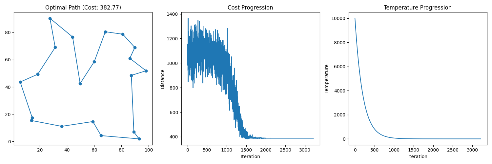

## Recording Learning What

### Project: pagerank

$ Core Formula: $

$$
PR(p) = \frac{1-d}{N} + d \sum_{i \in link(p)} \frac{PR(i)}{NumLinks(i)}
$$

首先是那个 $iterate\_pagerank$ 函数，我刚开始想用拓扑排序的想法，但是实际上是不对的，拓扑排序适用于有向无环图，但是很显然网页的链接并不一定满足无环的条件，导致拓扑排序有可能压根没有起点

后来问了DeepSeek，估计也是标准写法，就是先不管计算 $PR(p)$ 时依赖的 $PR(i)$ 是不是准确的，就一直按照公式计算，直到与前一次的差别 $TotalDiff$ 小于一个设定的阈值 $Threshold$ ，就认为已经收敛，将答案作为正确值

这种做法我以前从来没见过，虽然现在不能完全证明合理性，但是想象一下倒也合理

至于 $sample\_pagerank$ 函数，基于 $Markov Chain$ ，得出转移概率分布，然后不断模拟（利用Python的 `cur_page = random.choices(list(corpus.keys()), weights = transition.values(), k = 1)[0]` 函数），利用 $Monte Carlo Method$ 的思想得出概率分布，当然，核心在于函数是否能做到接近真随机

### Project: knights

这个项目就是一堆逻辑表达式：$And, Or, Not, Implication(蕴含式)$ ，已经给了一个自动判断命题是否能成立的程序，这个程序的写法是我要学习的，里面涉及到 Python 里面很多类的写法，因此让 DeepSeek 帮我写了一个 `Class Usage in Python.py `文件，里面都是面向对象编程范式的语法

比如 @classmethod 和 @staticmethod 的区别，前者可以接受 cls 参数，然后访问所在类中的成员和方法，适用于工厂模式，但是后者写法上和普通函数一致，不接受 self, cls 参数，但是就和C++的static成员函数一样，不能访问类中成员或非static的方法

至于什么是**工厂模式**，其重要思想在于**开闭原则**：对扩展开放，对修改关闭

@property 修饰在一个函数前面，代表这个函数被当作属性一样访问，不用最后加上 ()，而 @propertyname.setter 默认为该property的修改函数，当赋值操作（如 `property = new_value`）执行时，该函数会被自动调用

属性前面加一条下划线 (`_property`) 代表变量受保护，两条下划线(`__property`) 代表变量私有

Python同样支持运算符的重载，只是和C++中显式的对运算符操作重新写一个函数不同，Python通过重写 `__add__, __mul__` 等类似具有特殊含义名称的函数，如:

```Python
class Circle:
    def __init__(self, radius):
        self.radius = radius

    def __add__(self, other):  // 这就是对加法运算的重载方法
        return Circle(self.radius + other.radius)
```

Python的析构函数名称是 `__del__`

### Project: minesweeper

在Python中很多对列表的操作都是原地修改，如 对list的remove、对dict的del，在迭代过程中，如果修改了该列表，就有可能会对后续的迭代造成影响，因此可以对迭代对象的副本进行操作，避免干扰迭代过程：

```python
data = {
    "temp1": 123,
    "temp2": 456,
    "data": 789,
    "temp3": 101112
}
# 复制所有键列表，再进行删除
for key in list(data.keys()):
    if key.startswith("temp"):
        del data[key]
print("删除temp开头的键后：", data)  
# 输出：{'data': 789}

```

而C++中少见这样支持自定义原地修改的函数，大部分都要自己手搓

这个项目中还有一个我第一次写没想到的，和前面pagerank的写法有点类似，就是利用while循环，不断地对知识库进行更新修改，得到新知识，直到不能更新为止，这里的代码看起来有相当高的时空复杂度，但也是得到正确答案的一种方法

### Project: heredity

看起来是一个遗传概率计算问题，实际上是贝叶斯定理运用的典型

在项目中，已知一个人是否患有某疾病，以及其亲属的表现型，已知该疾病等位基因在人群中各基因型的频率以及相应基因型的发病率，要求根据已知信息推断其他所有人的基因型和表现型的 $probability$ $distribution$ 

刚开始看到题中给的框架代码让我求 $joint$ $probability$ ，最后还要 $normalize$ ，看解法才反应过来这是要用贝叶斯，不是高中生物题:cry:

在 Uncertainty 这个 lecture 里面，从概率论的基本知识开始，详细解释了贝叶斯网络、蒙特卡罗方法、(隐)马尔可夫链，其中，贝叶斯网络可以较为精确的求出在给定 evidence 下事件的  $probability$ $distribution$，但是当节点和状态数过大时，计算量会很大；因此，我们可以利用每种状态下的 $transition$ $model$，通过Python中的随机函数去模拟这一过程，来近似的得到每一个事件的概率，也就是蒙特卡罗方法；马尔可夫链是一种根据 $conditional$ $probability$ 进行相应条件转移的方法，并且基于一个简化假设：当前状态只依赖于先前的有限个状态

lecture里面有一个说法让我印象深刻：条件概率正比于联合概率，即
$$
\exist \alpha \in constant, P(A| Condition) = \alpha P(A, Condition)
$$
感觉怪怪的，只能作为一种感性的理解，但是仔细想想，Condition 如果是一个已知的 evidence，其在计算时确实可以被当作一个常数，在某些较为简单的概率计算场景下，可以直接计算出每一种可能情况的 $joint$ $probability$ ，然后 $normalize$ ，就可以得到相应的条件概率分布，利用正比这一说法也很好理解，但是如果较为复杂，贝叶斯网络节点较多的时候，用这种方式理解恐怕有点不妥

本题其实就是利用了这种想法，求每一种可能状态的 $joint$ $probability$ ，最后 $normalize$ ，就得到了在已有一些 evidence 的情况下对应的条件分布，还需进一步理解，实际上这应该也是贝叶斯问题的核心思想

### Lecture: optimization

hill-climbing 方法进行 ==local search== 的几种变体，为了增大得到 global optimization 的可能性，而不是被困在局部最优解中

| Variant                       | Defination                                                   |
| ----------------------------- | ------------------------------------------------------------ |
| Steepest-ascent Hill Climbing | **选择价值最高的邻居**：在每一步中，算法会评估所有邻居的状态，并选择其中价值最高的一个作为下一步。这种方法确保每次移动都是朝着当前最优的方向，但可能会陷入局部最优解，因为它只关注当前的最优选择，而没有全局视野。 |
| Stochastic Hill Climbing      | **从价值更高的邻居中随机选择**：与最陡上升法不同，这种方法不会总是选择最优的邻居，而是从所有比当前状态更好的邻居中随机选择一个。这种方法增加了搜索的多样性，有助于避免陷入局部最优解，但可能会降低收敛速度。 |
| First-choice Hill Climbing    | **选择第一个价值更高的邻居**：当邻居数量非常多或计算每个邻居的成本较高时，这种方法会随机检查邻居，并选择第一个比当前状态更好的邻居。它不需要评估所有邻居，因此在某些情况下更高效，但可能会错过更好的解。 |
| Random-restart Hill Climbing  | **多次进行爬山法**：这种方法通过从不同的随机初始状态多次运行爬山法来增加找到全局最优解的概率。每次重启都从新的随机点开始，避免了单次运行陷入局部最优的问题。虽然计算成本较高，但能显著提高找到更好解的机会。 |
| Local Beam Search             | **选择价值最高的n个邻居**：与传统的爬山法不同，局部束搜索同时跟踪多个状态（称为“束”）。在每一步中，它会从所有邻居中选择价值最高的n个状态继续搜索。这种方法结合了爬山法和束搜索的优点，能够在多个路径上进行搜索，增加找到全局最优解的可能性。 |

#### simulated annealing  (for local search)

**先大胆探索，后精细调整**，允许部分movement使得状态更差，从全局来看，这减少了完全陷入局部最优解的可能性

经典的旅行商问题便可基于模拟退火算法解决，Python代码如下：

```python
# 随机生成城市坐标
def generate_cities(n_cities):
    cities = []
    for _ in range(n_cities):
        x = random.uniform(0, 100)
        y = random.uniform(0, 100)
        cities.append((x, y))
    return cities

# 计算路径总长度
def path_distance(path):
    distance = 0
    for i in range(len(path)):
        x1, y1 = cities[path[i]]
        x2, y2 = cities[path[(i+1)%len(path)]]
        distance += math.sqrt((x2-x1)**2 + (y2-y1)**2)
    return distance

# 生成邻域解（交换两个城市）
def get_neighbor(path):
    new_path = path.copy()
    i = random.randint(0, len(path)-1)
    j = random.randint(0, len(path)-1)
    new_path[i], new_path[j] = new_path[j], new_path[i]
    return new_path

# 模拟退火算法
def simulated_annealing(cities, T=10000, T_min=1e-3, alpha=0.99, max_iter=1000):
    current_path = list(range(len(cities)))
    random.shuffle(current_path)
    current_cost = path_distance(current_path)
    
    best_path = current_path.copy()
    best_cost = current_cost
    
    costs = [current_cost]
    temperatures = [T]
    
    while T > T_min:
        for _ in range(max_iter):
            new_path = get_neighbor(current_path)
            new_cost = path_distance(new_path)
            delta = new_cost - current_cost
            
            if delta < 0 or random.random() < math.exp(-delta / T):
                current_path = new_path
                current_cost = new_cost
                
                if current_cost < best_cost:
                    best_path = current_path.copy()
                    best_cost = current_cost
        
        costs.append(current_cost)
        temperatures.append(T)
        T *= alpha
    
    return best_path, best_cost, costs, temperatures
```

其可视化结果如下：



#### linear programming

#### constraint satisfaction (graph)

###  Project: crossword

虽然这是 optimization lecture 对应的作业，但是其思想还是偏向搜索，主要思路如下：

首先是一元约束，或者说 $node$ $consistency$，在本项目中初始状态下，由于 crossword 中每一个空格块对应的 domain 都是全体单词，然而空格块长度必须要和单词长度一致，这就可以将很多单词从domain中删除，保证每一个节点本身是满足条件的

然后就是二元约束，或者说是弧约束，利用 $ac3$ 算法，其基本思想在于：对于给定的两个相互联系的变量 $x, y$（在本题中，即相邻的两个空格块，可用 `self.neighbors(x)` 访问），遍历 $x$ 的domain，如果domain有某个值，使得 $y$ 的domain中没有一个是符合条件的，则这个值将被移除；算法中用到 `deque` 来存储未被弧约束的变量对

上述两种约束可以大大减少后续进行搜索时不必要的遍历

最后就是核心步骤：搜索，和 $DFS$  很像，全程传递 $Assignment$ 变量，探索所有可能性，如果遇到不可能的就立即回溯；在遍历时也有一个优先级：总是先遍历约束少的；其中最先遍历的state由 $Constrait Graph$ 中节点的度排序后决定

### Lecture: Learning

lecture 一开始先讲述了 $supervised$ $learning$ 中的 $KNN$ $(k-nearest-neighbors$ $classification)$ ，算法的核心思想就是在现有已经被标签的数据集中，找到 k 个最近邻的点，利用**投票机制**预测该数据点的标签，其优点很明显，易于理解并且适应于各种分类问题，但是缺点也非常突出，首先算法的计算开销很大，对每个点进行预测的时候都要计算与样本中所有点的距离，再进行排序；其次，该算法对于异常值 $(outliers)$ 和随机噪声 $(random noise)$ 非常敏感，对较高维度的数据集表现也会很差

